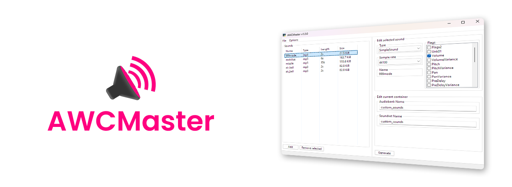

# AWCMaster


[](https://github.com/qyful/awcmaster/releases)
[](https://github.com/qyful/awcmaster/issues)
[](https://github.com/qyful/awcmaster/network/members)
[](https://github.com/qyful/awcmaster/stargazers)

## Overview

**AWCMaster** is an open-source GUI-based tool designed to help you create and edit native audio files for Grand Theft Auto V and FiveM. With an easy-to-use interface and powerful features, this tool simplifies the process of customizing audio for your scripts and mods.

## Usage

**Install the latest Windows release** from [here](https://github.com/qyful/AWCMaster/releases/) or download the source files:

```console
$ git clone https://github.com/qyful/AWCMaster.git
```

Then, navigate to the newly-created folder:

```console
$ cd AWCMaster/src
```

and run the `main.py` file:

```console
$ python main.py
```

**Then you're done!** There are some more advanced features such as flags, however the defaults are more than enough to get started creating your own native sounds for GTA V.

## Contribution Guidelines

We welcome contributions from the community! To ensure a smooth collaboration process, please follow these guidelines:

1. **Fork the repository** and create your branch from `main`.

2. **Open an issue** before working on significant changes to discuss your ideas.

3. **Commit messages** should be descriptive. Follow the convention of using the present tense, e.g., "Add feature" or "Fix bug."

4. **Submit a pull request** after making your changes. Make sure to reference any related issues in your PR.

5. **Ensure all tests pass** and the code adheres to the [PEP 8 guidelines](https://peps.python.org/pep-0008/) before submitting your PR.

6. **Respect the community** and the work of others. Collaboration is key!

## License

This project is licensed under the GPLv3 License. See the [LICENSE](https://github.com/qyful/AWCMaster/blob/main/LICENSE)

## Contact

For any questions or feedback, feel free to [open an issue](https://github.com/qyful/awcmaster/issues) or reach out directly via Discord @Qyful.

---

*This project is not affiliated with or endorsed by Rockstar Games, Grand Theft Auto V, or FiveM.*